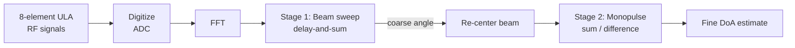

# Enhanced DoA Estimation Using Beamforming-Integrated Monopulse

Final Year Design Project (2023-FYDP-06), Department of Electrical Engineering, **UET Lahore**, in collaboration with **SUPARCO**.

We are building a real-time **Direction of Arrival (DoA)** estimator that combines **digital beamforming** with the **Monopulse** technique. The goal is Monopulse-level accuracy over a much wider angular range, using an algorithm light enough to run on an FPGA.

---

## The Problem

- **Monopulse** is fast and accurate, but only near boresight. Its accuracy falls off as the target moves away from the beam center.
- **High-resolution methods** like MUSIC are accurate everywhere, but their O(N³) eigen-decomposition is too heavy for real-time FPGA processing.

## Our Approach: Two-Stage Estimation

1. **Coarse search:** a narrow beam is steered electronically across the area of interest. The direction with the highest output power gives a coarse angle.
2. **Fine estimate:** the beam is re-centered on that angle and Monopulse (the difference/sum ratio mapped through an S-curve) gives the precise angle. Because the target is now near boresight, Monopulse works where it performs best.

## Design Constraints

| Parameter | Specification |
|---|---|
| Signal | RF, 1–2 GHz band, single far-field source |
| Array | 8×1 uniform linear array, λ/2 spacing at 2 GHz (7.5 cm) |
| Processing | FFT-domain delay-and-sum beamforming + Monopulse |
| Test SNR range | −15 dB to +25 dB |
| Hardware | SUPARCO-provided STM32 + ADAR and RFSoC platforms |
| Software | MATLAB, free vendor toolchains |
| Timeline | 28 weeks (two semesters) |

## Getting Started

1. Clone the repository.
2. Open MATLAB (Phased Array System Toolbox required).
3. Run any script in `Codes/` to reproduce its simulation. Compare the plots with the ones in the matching `Results/` folder.

## Team

| Name | Role |
|---|---|
| Ammarah Wakeel | Team member |
| Ayesha Anwar | Team member |
| Eman | Team member |
| Eman Maqsood | Team member |

**Supervisor:** Dr. Syed Shah Irfan Hussain · **Co-Supervisor:** Dr. Avais Qureshi .
**Mentor & Advisior** : Dr. Abdul Maalik.

## Acknowledgments

Hardware support and technical collaboration from the **Space and Upper Atmosphere Research Commission (SUPARCO)**.

## Key References

1. S. M. Sherman and D. K. Barton, *Monopulse Principles and Techniques*, 2nd ed. Artech House, 2011.
2. H. L. Van Trees, *Optimum Array Processing*. Wiley-Interscience, 2002.
3. S. Yeh, "Development of a digital tracking array with single-channel RSNS and monopulse digital beamforming," M.S. thesis, Naval Postgraduate School, 2010.
4. MathWorks, "What Is Beamforming?" https://www.mathworks.com/discovery/beamforming.html
